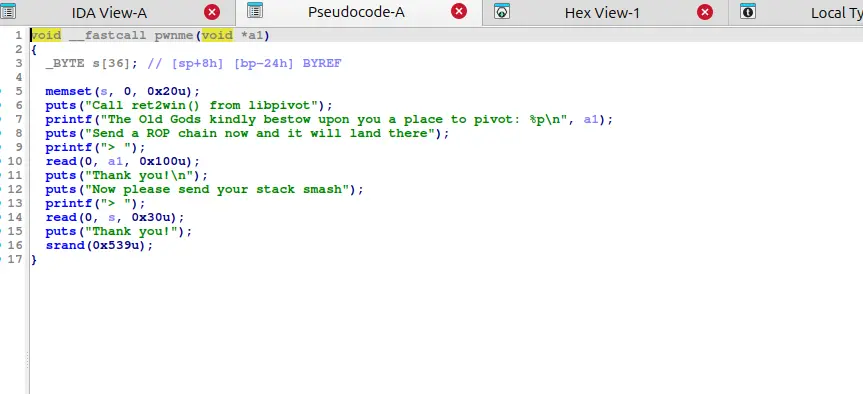
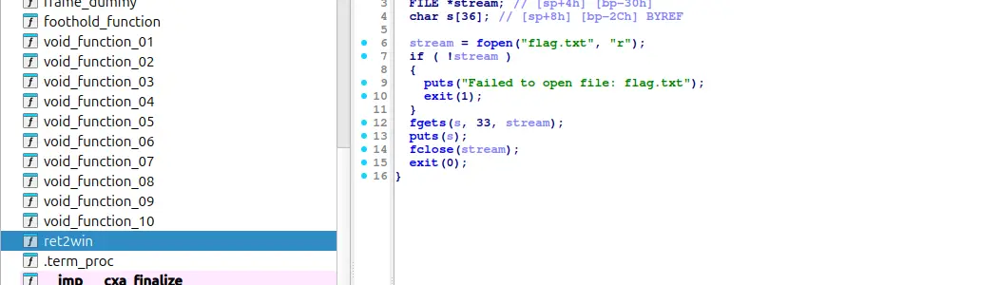

so we are granted a convenient way to build a rop chain 

there exist puts and a foothold_function in plt, and a ret2win function that print the flag in lib

so our goal is to use puts to leak the foothold_function address, then calculate the ret2win function and jump to it