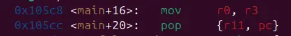

theres a ret2win function in plt that print out the flag but require us to set r0 r1 and r2





setting the gdb into arm mode and inspecting the executable section, we got ourself some handy gadget that should let us finish this challenge

```

```