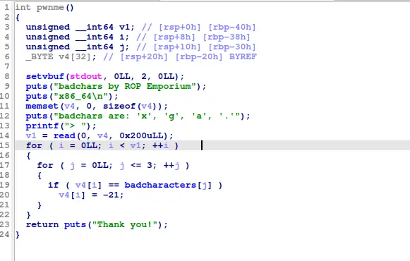

the challenge check for every bytes of the input if there exist 'x', 'g', 'a' or '.', which meant we cant just do something like print_file(./flag.txt)

no bypass this, we can use xor, which coveniently exist as a gadget