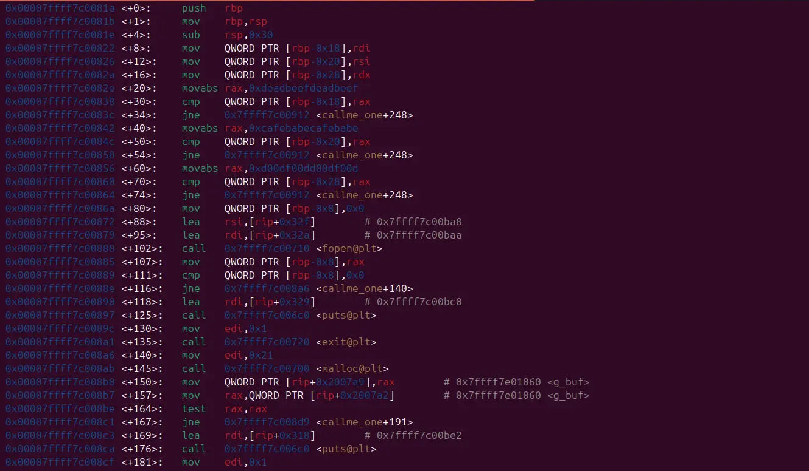
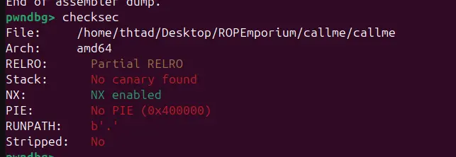

there exist three "callme" function in this binary

upon inspection in gdb, it seems that those call me function check for rdi, rsi, rdx for specific values and each print out part of the flag

paired with the fact that there is no pie, building a rop chain should be easy enough