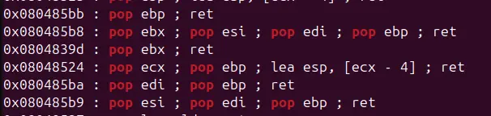

pwnme check the buffer after read to see if some particular character is included

to bypass this, we can hash the flag address in some way to bypass the check

with some convenient gadgets that exist withing the binary, the job is easily done