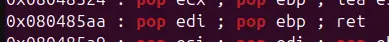

theres a function named print_file in the plt section




there are also two particular gadgets that let us write into memory

so in this challenge, we just need to write into the memory and call print_file

```

```