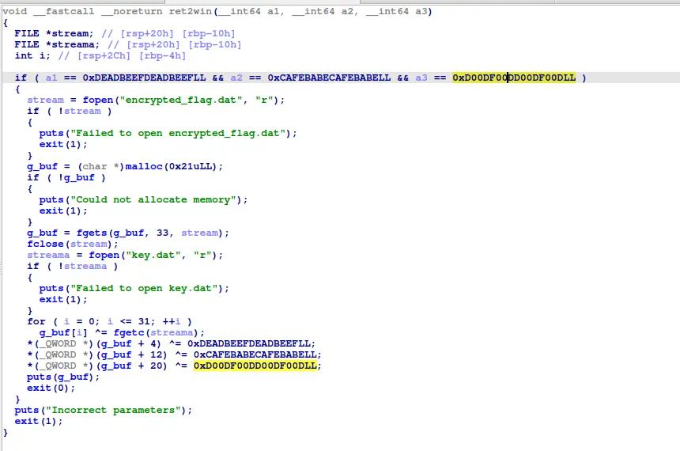
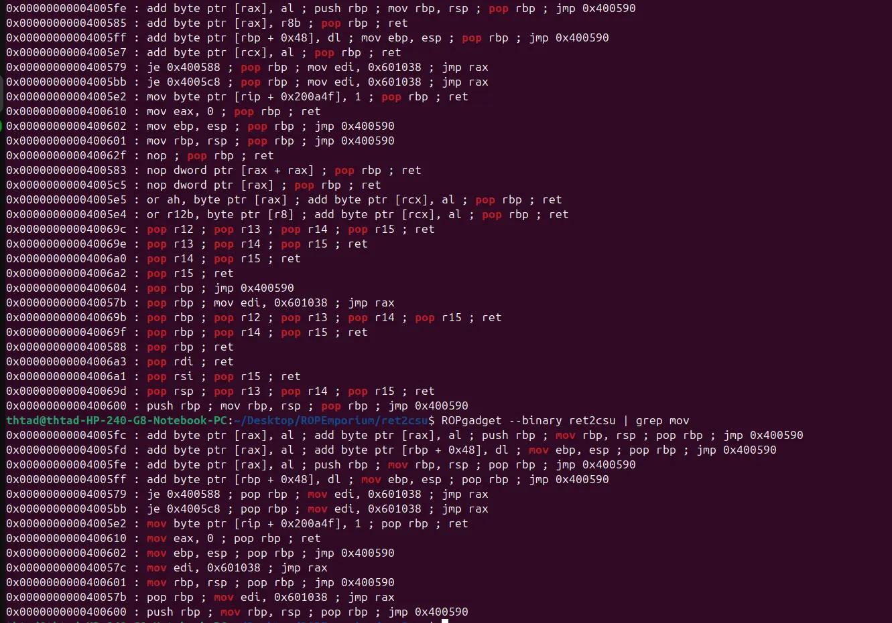
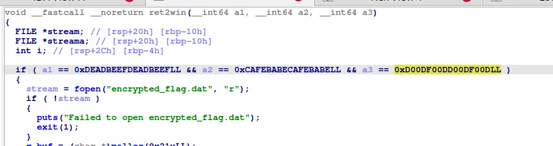

the win function exist in the plt section, which mean that we can call it directly in our chain

unfortunately, ret2win check for rdi, rsi and rdx for specific values

now we dont exactly have those convenient gadget to manipulate rdx

searching the binary using objdump, we discover our necessary apparatus

now, the tricky part is dealing with call |r12+rbx * 8|

our candidates exist in the plt sections, which are pwnme and ret2win

bad news! pwnme modify rdx while ret2win exit, breaking the program

that left us with one hope: looking in the data section of the binary for some lucky finds

with patient, we find a perfect candidate, which is a gadget that does absolutely nothing and return