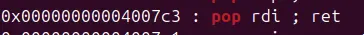

in this problem we also have a way to overflow the buffer. However, the usefulFuntion does not read the flag as the previous challenge

checking ROPgadgets, we acquire a way to manipulate rdi

checking the binary memory, we find /bin/cat flag.txt, how convenient

viewing hex data in ida grant us the exact address, given that the binary has no 