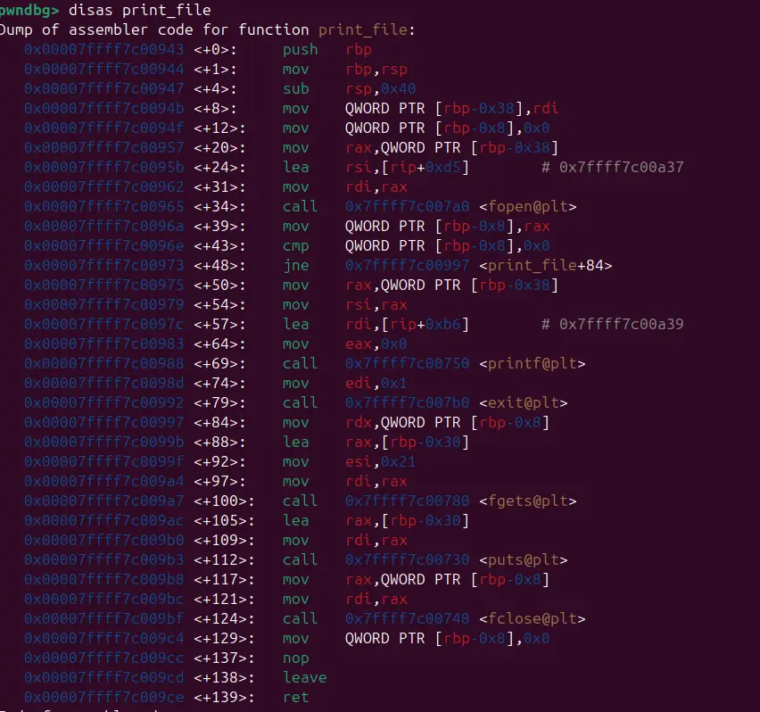

there exist a literal argument named print_file in plt and no pie is presented

inspecting print_file reveals that the function only take an argument, which is the file path

paired with a few notable gadget and the challenge should be a cakewalk